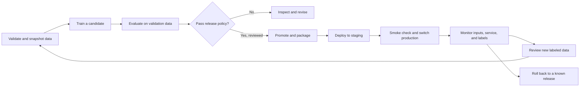

# A small, complete MLOps course

The project is deliberately small: one dataset, one scikit-learn pipeline, one
HTTP contract, and one container image. You operate the model through its full
lifecycle, then repeat the process on two managed cloud platforms.

## How to follow this course

Begin with the [20-minute walkthrough](quickstart.md) for an early working result.
Then follow the numbered lessons in order. Each lab gives commands, an explanation,
an exercise and a “Done when” checkpoint. Run one command block at a time and
inspect its result before continuing; a failing gate is sometimes the exercise.

| Stage | Required lessons | Stop and check before moving on |
| --- | --- | --- |
| Understand the local loop | 01–03 | Explain training vs validation vs test; reject a weak candidate |
| Operate locally | 04–06 | Serve, monitor, retrain and roll back; run the checks |
| Repeat on Azure | 07–08 | Verify served versions and cleanup in your subscription |
| Repeat on AWS | 09–10 | Verify approval, served versions and cleanup in your account |
| Demonstrate the whole lifecycle | 11 | Complete the capstone and incident report |

Start with either the terminal lab or its notebook; you do not need to understand
every source file to run a lesson. Notebook registries are temporary and separate
from terminal state. Run the terminal prerequisites when moving to a later
terminal lesson. Sections about team pipelines, canaries, managed monitoring and
production hardening are extensions; the core lab does not require those tools.

Most commands run from `python/`. Cloud setup explicitly switches to the repository
root; cloud lifecycle commands switch back. Keep each provider's variables in the
same terminal session. If you rerun a lab, use new run IDs, release directories,
cloud job names and model versions where instructed. See the
[folder and command map](../python/README.md) and [glossary](glossary.md).

## What you will build

By the end, you should be able to identify the code, dependencies, data, model,
evaluation, approval, and deployment behind a prediction. You should also be
able to reject a bad candidate and recover from a bad release.

## Prerequisites

Basic Python, a terminal, Git, and an understanding of train/test splitting are
enough. Install [uv](https://docs.astral.sh/uv/getting-started/installation/).
Python 3.12 is selected by the project. Docker is needed from lesson 04 onward;
Linux, macOS, or Windows with WSL2 can run the Bash examples. CPU-only hardware
is sufficient. Allow roughly 12–18 hours plus cloud provisioning time, spread
over several sessions.

Cloud lessons additionally need an Azure subscription or AWS account with
permission to create the resources listed in the setup lessons. Complete the
local part first. No LLM service or GPU is required.

## Lesson sequence

| Lesson | Outcome and hands-on work | Approximate time |
| --- | --- | --- |
| [01. First model](01-iris-training.md) | Understand Iris, train, evaluate, inspect the original notebook | 45 min |
| [02. Data and experiments](02-data-and-experiments.md) | Create fixed CSV splits; record runs, hashes, parameters and metrics | 60 min |
| [03. Evaluation and promotion](03-evaluation-and-promotion.md) | Reject a weak model; promote, export, test, and roll back | 75 min |
| [04. Serving and containers](04-serving-and-containers.md) | Validate requests; run the same API directly and in Docker | 60 min |
| [05. Monitoring and retraining](05-monitoring-and-retraining.md) | Simulate drift, join delayed labels, retrain without changing holdouts | 90 min |
| [06. CI and release delivery](06-ci-and-delivery.md) | Run tests and notebooks in CI; review a release before cloud delivery | 60 min |
| [07. Azure setup](07-azure-setup.md) | Create workspace, registry and CPU compute; understand identities and costs | 60 min |
| [08. Azure lifecycle](08-azure-lifecycle.md) | Train remotely, import, register, deploy, switch traffic, monitor, clean up | 120 min |
| [09. AWS setup](09-aws-setup.md) | Create S3, ECR, IAM role and model package group | 60 min |
| [10. AWS lifecycle](10-aws-lifecycle.md) | Train remotely, approve a package, stage, release, roll back, clean up | 120 min |
| [11. Capstone and operations](11-capstone-and-operations.md) | Demonstrate a release and an incident; explain production extensions | 90 min |

The [model card](model-card.md) and [troubleshooting guide](troubleshooting.md)
support every lab. Each lesson ends with an observable completion check.

## Service mapping

For a custom tabular classifier, this course chooses Azure Machine Learning
and Amazon SageMaker AI. Microsoft Foundry and Amazon Bedrock are relevant to
foundation-model applications; they are not required for these labs. See
[Microsoft's service selection guide](https://learn.microsoft.com/en-us/azure/architecture/ai-ml/guide/data-science-and-machine-learning)
and [SageMaker AI setup](https://docs.aws.amazon.com/sagemaker/latest/dg/gs-set-up.html).

| Responsibility | Local lesson | Azure | AWS |
| --- | --- | --- | --- |
| Dataset versions | CSV snapshots and hashes | Data assets and Blob Storage | Hash-based S3 prefixes and object versions |
| Training | Python process | Azure ML command job / CPU cluster | SageMaker training job |
| Experiment evidence | Per-run JSON and files | Job outputs plus the same run files | Job artifacts plus the same run files |
| Model registry | JSON history and production pointer | Versioned model assets and approval tags | Model package versions and native approval status |
| Image registry | Docker images | Azure Container Registry | Amazon ECR |
| Serving | FastAPI on localhost | Managed online endpoint and deployments | Real-time endpoint and immutable endpoint configs |
| Promotion | Pointer update, then process restart | Smoke check, then traffic switch | Smoke staging, then create/update production endpoint |
| Monitoring | JSONL and Python report | Azure Monitor and Log Analytics | CloudWatch and S3 data capture |
| Authentication | Local machine only | Microsoft Entra identity | IAM / signed API requests |

## Keep the boundaries clear

The introductory lesson keeps its original 80/20 split and numerical target IDs.
Lessons 02 onward use a new 60/20/20 split and species names. Their artifacts live
in separate directories; never deploy the introductory `artifacts/model.joblib`
as a course release.

The local registry is designed for one operator. JSON files make the decisions
visible without introducing another service. It is not a concurrent or secure
registry. Cloud account permissions provide access control; checksum files
detect accidental modifications, not a malicious author who can rewrite them.

Cloud provisioning and endpoint operations are explicit commands. All notebooks
can execute locally with cloud cells disabled. Local tests do not prove a cloud
deployment works in your account: quota, networking, IAM and service availability
must be checked in the live labs. Resource cleanup is part of completing them.
